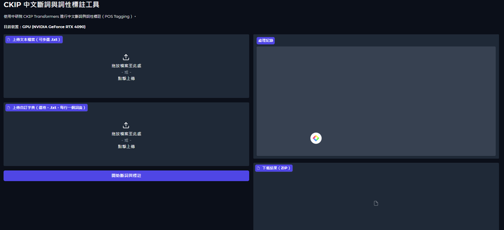

# 譯彩紛呈：重譯文本分析系統

**TransPrism — Retranslation I　語料淬煉 Corpus Refinery**

使用中研院 [CKIP Transformers](https://github.com/ckiplab/ckip-transformers) 進行中文斷詞與詞性標註（POS Tagging）；可輔以 LLM 進行專有名詞探勘，擴充詞典。為在本地端執行的應用程式。

提供 Gradio Web 介面，支援批次上傳多個文本檔案，並可載入自訂詞典進行詞彙合併。

> 相關文件：[系統使用說明手冊.docx](系統使用說明手冊.docx)、[系統架構圖.png](系統架構圖.png)

## 介面預覽



## 功能特色

- 批次處理多個 `.txt` 文本檔案
- **斷詞前文字前處理**：半形標點轉全形、異體字／錯字修正
- **斷詞後修正**：清除空白標記、依規則修正詞性與斷詞結果，並刪除以 `_ETCCATEGORY` 詞性開頭的整行
- **輸入防呆**：斷詞分頁偵測到「已斷詞」格式的輸入時會停止並提示重新上傳原文；專名探勘分頁則自動還原為原始文字
- **專名探勘（擴充詞典）**：用 NER 找出詞典未收錄的專有名詞，再以 LLM 過濾誤判，協助擴充自訂詞典
- **多家 LLM 供應商**：OpenRouter／OpenAI／Google Gemini／DeepSeek／Anthropic／Groq，模型可下拉選擇或自行輸入
- **進度顯示**：專名探勘提供進度條與每批用時／已審數即時回報
- **互斥執行**：斷詞與專名探勘一次只能執行一項，避免同時佔用模型資源／顯存
- **現代化介面**：信任藍 + 翡翠綠配色、Noto Sans TC 繁中字體、終端風處理紀錄框
- 自訂詞典支援（最長匹配合併）
- 自動偵測 GPU / CPU，有 GPU 時自動加速（斷詞與 NER 皆可使用 GPU）
- 處理紀錄即時顯示（最新訊息在最上方）
- 結果打包為 ZIP 下載
- 跨平台支援（Windows / macOS / Linux）

> 介面分為兩個分頁：**「斷詞與詞性標註」**（主功能）與 **「專名探勘（擴充詞典）」**（輔助擴充詞典，需 LLM API key，支援多家供應商）。

## 輸出格式

每個詞彙以 `詞彙_詞性` 格式輸出，詞彙之間以空格分隔：

```
那_Nep 一陣子_Nd ，_COMMACATEGORY 東京都_Nc 家家戶戶_Na 所_D 閒談_VA 的_DE 內容_Na
```

---

## 處理流程

每個檔案的處理依序經過三個階段：**斷詞前處理 → CKIP 斷詞與詞性標註 → 斷詞後修正**。

### 1. 斷詞前文字前處理（`preprocess_text`）

在送入 CKIP 模型前，先對原始文字做正規化：

- **半形標點轉全形**：將半形標點符號（如 `,` `.` `:` `"` `'`）轉為對應全形（`，` `．` `：` `＂` `＇`），但保留英數字（例如 `B.D` 中的 `B`、`D` 不變）。
- **異體字／錯字修正**：將常見異體字統一為標準字，對應如下：

  | 修正前 | 修正後 | 修正前 | 修正後 | 修正前 | 修正後 |
  |--------|--------|--------|--------|--------|--------|
  | 躱 | 躲 | 内 | 內 | 麽 | 麼 |
  | 爲 | 為 | 着 | 著 | 眞 | 真 |
  | 揷 | 插 | 旣 | 既 | 羣 | 群 |
  | 踪 | 蹤 | 脚 | 腳 | 啓 | 啟 |
  | 衆 | 眾 | 参 | 參 | 靑 | 青 |
  | 盗 | 盜 | 祇／祗 | 只 | | |

### 2. 斷詞後修正（`postprocess_line`）

完成斷詞與詞性標註後，逐段套用下列修正：

- **清除空白與雜訊標記**：刪除所有 `_WHITESPACE`、段落開頭的 `_FW`、以及 `＇_FW` 標記。
- **詞性與斷詞修正規則**：以「詞_詞性」為單位，套用一組正規表示式規則，修正特定詞彙的斷詞邊界與詞性標註（例如將人名／地名／專名統一標為 `Nb`／`Nc`、合併被切散的專有名詞、修正省略號 `……` 標記等）。
- **刪除整行**：在所有修正套用完之後，刪除「以 `_ETCCATEGORY` 詞性開頭」的整行（例如以省略號開頭的行），整行不輸出。

> **輸入防呆（斷詞分頁）：** 斷詞應上傳**原始未斷詞文本**。若不慎上傳了斷詞輸出檔（`詞_詞性` 格式，如 `_seg.txt`），系統會**立即停止處理**並提示「請改上傳原始、未斷詞的文本」，避免重複斷詞造成亂碼。

> **注意：** 後處理的詞性修正規則是針對特定語料（怪盜二十面相／明智小五郎系列文本）所調校，內容定義於 `app.py` 的 `_POST_RULES_RAW`。若用於其他文本，可自行在該清單中增刪規則，格式為 `('比對樣式', '取代結果')`，所有規則皆以詞邊界錨定，不會跨詞誤觸。

---

## 專名探勘（擴充詞典）

第二個分頁提供半自動的詞典擴充工具，協助你找出文本中「詞典尚未收錄的專有名詞」：

1. **NER 抽取候選**：用 CKIP `CkipNerChunker` 對全文做命名實體辨識，只保留名稱類實體（人名 PERSON、地名 LOC/GPE、機構 ORG、設施 FAC、族群 NORP、作品 WORK_OF_ART、事件 EVENT），並排除已在詞典中的詞。
2. **LLM 過濾誤判**：將候選詞與其例句分批送往 LLM，判斷是否為「值得收進詞典的真正專名」，自動剔除神祇泛稱、慣用語、單字殘片、被切散的不完整詞等誤判，並回傳收錄建議與理由。
3. **人工確認與匯出**：結果以表格呈現（含「收錄」勾選欄、次數、類型、LLM 建議、理由），預設依 LLM 建議勾選；你可手動調整後，按「匯出選取詞典」將選取詞**併入原詞典**（保留原順序、新詞附後、自動去重），下載 `user_dict_updated.txt`。

此功能與斷詞主流程**完全獨立**，只在按下按鈕時觸發，不影響斷詞速度。

> **輸入防呆：** 專名探勘應上傳**原始未斷詞文本**。若不慎上傳了斷詞輸出檔（`詞_詞性` 格式，如 `_seg.txt`），系統會自動偵測並還原為原始文字再進行 NER，並在處理紀錄提醒，避免產生 `Nc`、`小林_Nb` 等詞性標記殘片候選。

### LLM 設定（支援多家供應商）

專名探勘的 LLM 審核支援多家供應商，於介面「LLM 供應商」下拉選擇：

| 供應商 | 端點格式 | 常用模型範例 |
|--------|----------|--------------|
| OpenRouter | OpenAI 相容 | `google/gemma-4-26b-a4b-it`、`openai/gpt-4o-mini`、`anthropic/claude-3.5-sonnet` |
| OpenAI | OpenAI 相容 | `gpt-4o-mini`、`gpt-4o` |
| Google Gemini | OpenAI 相容 | `gemini-2.0-flash`、`gemini-1.5-pro` |
| DeepSeek | OpenAI 相容 | `deepseek-chat`、`deepseek-reasoner` |
| Anthropic | Messages API | `claude-3-5-haiku-latest`、`claude-3-5-sonnet-latest` |
| Groq | OpenAI 相容 | `llama-3.3-70b-versatile` |

API key 與模型可直接在介面欄位填入；欄位留空時則讀取專案目錄的 `.env`（已被 `.gitignore` 排除，不會上傳）：

```
OPENROUTER_API_KEY=你的_api_key   # 亦相容 LLM_API_KEY
OPENROUTER_MODEL=google/gemma-4-26b-a4b-it   # 亦相容 LLM_MODEL
```

- 模型欄位為下拉選單，可從清單挑選，或選「自行輸入模型名稱…」後直接輸入任意模型 slug。
- 免費／付費模型皆可（免費模型速率較嚴、JSON 穩定度較弱）。

> **顯卡記憶體與互斥執行：** 專名探勘的 NER 預設使用 GPU（載入失敗時自動退回 CPU）。為避免斷詞與探勘**同時**載入多個模型而導致小顯存（如 6GB）VRAM 不足，兩項作業採**互斥執行**——一次只能跑一項，另一項執行中時按鈕會立即顯示「系統忙碌中」，待其完成後再試即可。

---

## 系統需求

- Python 3.9 以上
- 建議至少 8GB RAM
- （選用）NVIDIA GPU + CUDA 驅動程式，可大幅加速處理速度

---

## 安裝步驟

### 1. 下載專案

```bash
git clone https://github.com/suhsiung/ckip_segmentation_sumin.git
cd ckip_segmentation_sumin
```

### 2. 建立 Python 虛擬環境

#### Windows

```bash
python -m venv venv
venv\Scripts\activate
```

#### macOS / Linux

```bash
python3 -m venv venv
source venv/bin/activate
```

### 3. 安裝 PyTorch

請根據你的平台與硬體選擇對應的安裝指令。

#### 僅使用 CPU（所有平台通用）

```bash
pip install torch torchvision torchaudio
```

#### Windows / Linux（NVIDIA GPU，CUDA 12.4）

```bash
pip install torch torchvision torchaudio --index-url https://download.pytorch.org/whl/cu124
```

#### macOS（Apple Silicon M1/M2/M3/M4，自動使用 MPS 加速）

```bash
pip install torch torchvision torchaudio
```

> 其他 CUDA 版本或平台組合，請參考 [PyTorch 官方安裝頁面](https://pytorch.org/get-started/locally/)。

### 4. 安裝其他依賴套件

```bash
pip install -r requirements.txt
```

---

## 使用方式

### 啟動應用程式

```bash
python app.py
```

啟動後瀏覽器會自動開啟，若未開啟請手動前往：

```
http://127.0.0.1:7860
```

### 操作步驟

1. **上傳文本檔案** — 點擊左側上傳區，選擇一個或多個 `.txt` 檔案
2. **上傳自訂詞典**（選填）— 上傳一個 `.txt` 檔案，每行一個詞彙
3. **點擊「開始斷詞與標註」** — 程式將自動進行斷詞與詞性標註
4. **下載結果** — 處理完成後，右側會出現 ZIP 下載連結

### 自訂詞典格式

自訂詞典為純文字檔，每行一個詞彙，例如：

```
人工智慧
機器學習
自然語言處理
深度學習
```

程式會使用最長匹配法，將 CKIP 斷詞結果中被切散的詞彙重新合併為詞典中的完整詞彙。

---

## 詞性標記（POS Tag）對照表

以下為 CKIP 常見詞性標記說明：

| 標記 | 說明 | 標記 | 說明 |
|------|------|------|------|
| Na | 普通名詞 | VA | 動作不及物動詞 |
| Nb | 專有名詞 | VC | 動作及物動詞 |
| Nc | 地方名詞 | VH | 狀態不及物動詞 |
| Nd | 時間名詞 | VK | 狀態及物動詞 |
| Nep | 指代詞 | D | 副詞 |
| Nf | 量詞 | P | 介詞 |
| Nh | 代名詞 | Caa | 對等連接詞 |
| SHI | 「是」 | Cbb | 關聯連接詞 |
| DE | 「的」 | T | 語助詞 |

> 完整詞性標記請參考 [CKIP 詞性標記說明](https://github.com/ckiplab/ckip-transformers/wiki/POS-Tags)。

---

## 常見問題

### Q: 啟動時出現 CUDA 相關錯誤？

請確認：
1. 已安裝 NVIDIA GPU 驅動程式
2. PyTorch 安裝時選擇了正確的 CUDA 版本
3. 若無 GPU，程式會自動使用 CPU 模式運行

### Q: 首次執行速度很慢？

首次執行時需從 HuggingFace 下載 CKIP BERT 模型（約 400MB），下載完成後會快取在本機，後續啟動不需重新下載。

### Q: macOS 上沒有 NVIDIA GPU，可以使用嗎？

可以。程式會自動偵測裝置，沒有 NVIDIA GPU 時會使用 CPU 運行。Apple Silicon 的 Mac 也可正常使用。

### Q: 如何更換模型？

在 `app.py` 中修改 `load_models` 函式的 `model` 參數：
- `"bert-base"` — 預設，平衡速度與準確度
- `"bert-tiny"` — 更快但準確度略低
- `"albert-base"` — 較小的模型

---

## 專案結構

```
ckip_segmentation_sumin/
├── app.py                  # Gradio 主程式
├── requirements.txt        # Python 套件依賴
├── README.md               # 使用說明（本檔案）
├── 系統使用說明手冊.docx   # 完整使用手冊
├── 系統架構圖.png          # 系統架構圖
├── make_manual.py          # 手冊產生腳本
└── make_arch_diagram.py    # 架構圖產生腳本
```

---

## 授權

本工具使用 [CKIP Transformers](https://github.com/ckiplab/ckip-transformers)，該套件採用 GPL-3.0 授權。
